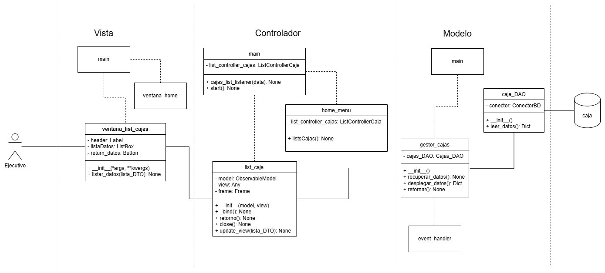
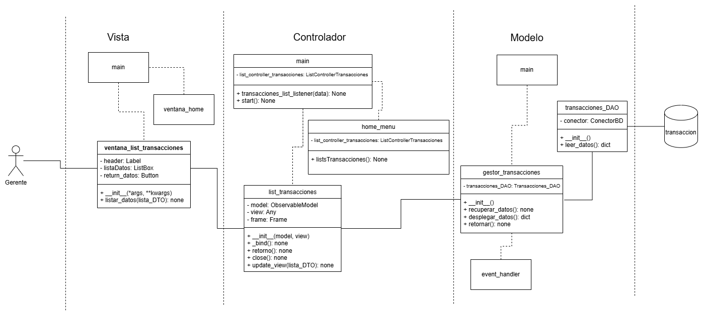
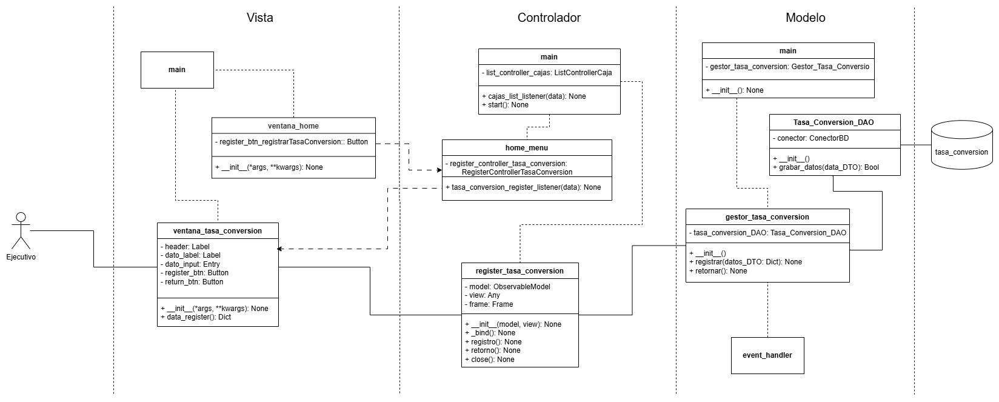

## Instalar dependencias
```
pip install -r dependencias.txt
```


## Historias de usuario a implementar

**Primer sprint:**

HU1 - Como ejecutivo necesito saber que cajas están activas para evaluar la estrategia de atención.



**Segundo sprint:**

HU2 - Como gerente necesito determinar las ganancias en pesos que ha reportado cada moneda tranzada para evaluar futuras inversiones.

HU3 - Como ejecutivo necesito consultar la disponibilidad de pesos de cada caja para coordinar solicitud de dinero al banco.

HU4 - Como gerente necesito saber cual fue la moneda más vendida para planear un nuevo día de operación.



HU5 - Como gerente necesito validar credenciales para acceder a funcionalidades de mi responsabilidad.


**Tercer sprint:**

HU6 - Como ejecutivo necesito registrar tipos de cambios para iniciar la operación del día.



HU7 - Como cajero necesito registrar la disponibilidad de pesos para iniciar el trabajo diario de la caja.

HU8 - Como ejecutivo necesito realizar transacciones de compra de monedas extrajera para obtener los ingresos de la empresa.
